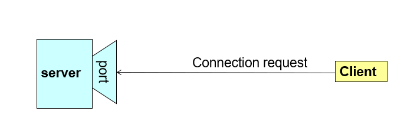
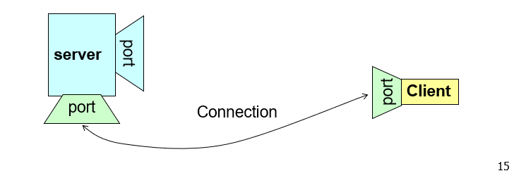

# socket-programming-java
socket programming with java playground

## what is socket?
Sockets provide an interface for programming networks at the transport layer
Network communication using Sockets is very much similar to performing file I/O
In fact, socket handle is treated like file handle.
The data streams used in file I/O operation are also applicable to socket-based I/O
Socket-based communication is programming language independent.
This means, a socket program written in Java language can also communicate to a program written in Java or non-Java socket program
Socket  = IP address + Port number

## How socket works?
A server program runs on a specific computer and has a socket
that is bound to a specific port. The software
server waits and listens to the socket for a
client program to make a connection request.

If everything goes well, the server accepts the connection.
Upon acceptance, the server gets a new socket bounds
to a different port. 
It needs a new socket (consequently a different port number) so that it can continue to listen to the original socket
for other connection requests while serving the
connected client.

Java’s .net package provides two classes:
- `Socket` for implementing a client
- `ServerSocket` – for implementing a server

